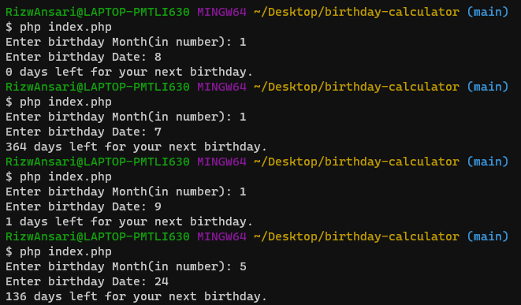
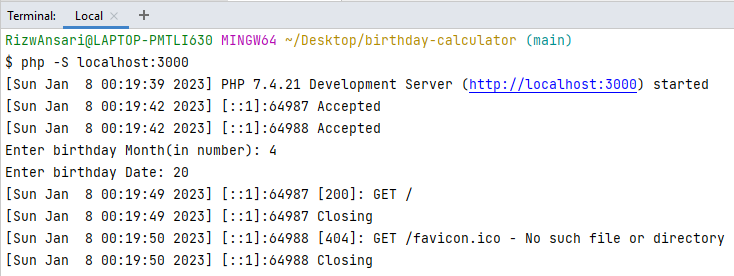
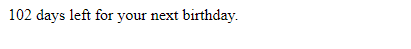

## To run the project:

### Method-1
- Open Terminal.
- Navigate to the project's directory.
- Type ``` php index.php ``` and press enter.
- Follow the instructions.

###### Output in terminal:


### Method-2
- Open Terminal.
- Navigate to the project's directory.
- Type ``` php -S localhost:3000 ```
- Open URL ``` http://localhost:3000 ```.
- Follow the instructions in the terminal.
- Check output in the browser.


###### Output in browser:


